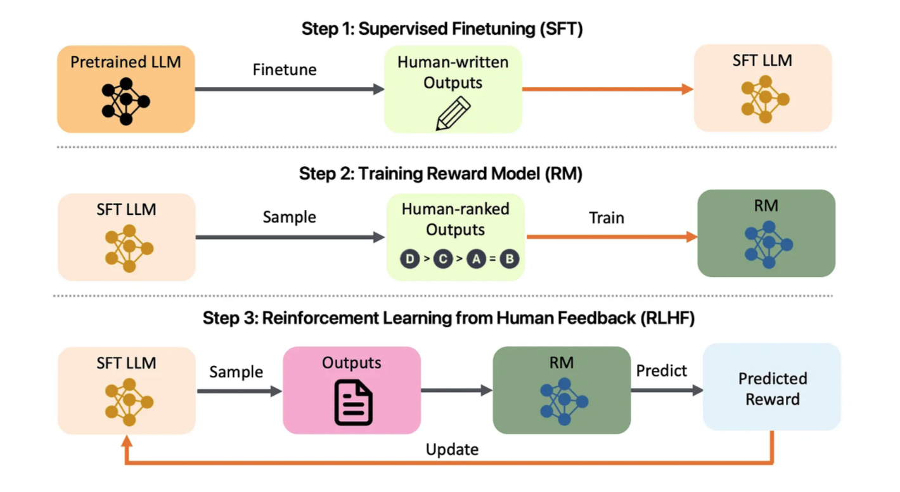
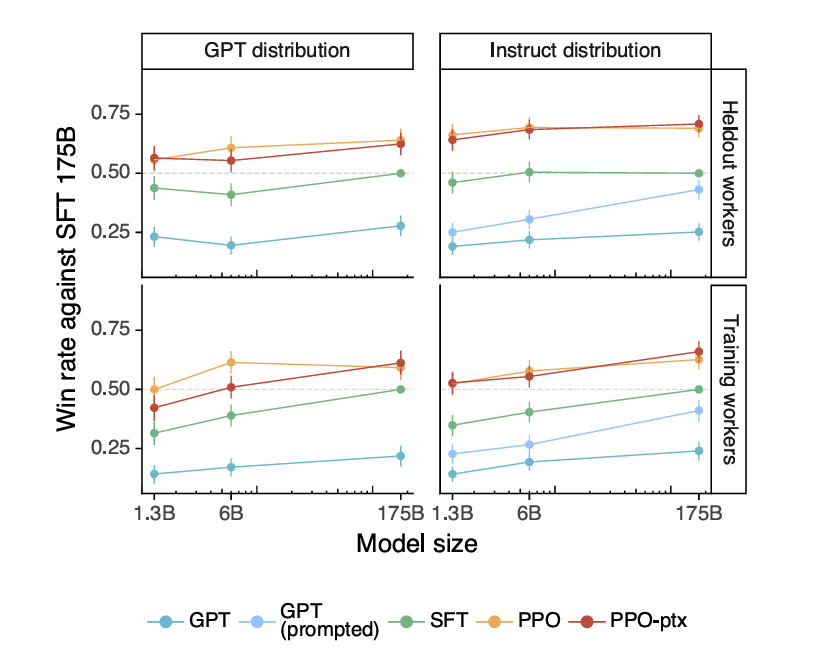

# Training language models to follow instructions with human feedback

(image generated with ChatGPT-4/DALL-E)

## Introduction
Large language models are now being leveraged for a variety of uses, however the responses they produce are not always aligned with the intents of their users. In this sense, alignment refers to ensuring models behave with respect to the intention of the user (Greyling 2023). Moreover, LLMs can even produce responses that many consider to be toxic, harmful, or factually false. As a solution to this issue, a research group has trained a language model so that it can avoid such issues. With a combination of certain fine-tuning techniques and human feedback, the research group (Ouyang, et al. 2022) trains a version of the OpenAI GPT-3 model to create responses that are more aligned with the users. 

## Motivation

(image generated with ChatGPT-4/DALL-E)

LLMs can be more trusted and useful if they are more likely to give results that their users expect. By training the model to act according to user intention, one can potentially decrease the likelihood of any unexpected and possibly harmful outputs. In improving the alignment of LLMs with user intentions, one can enhance the usability, reliability, and safety of these models in practical applications. 

## Background

### Reinforcment Learning from Human Feedback

Reinforcement learning from human feedback (RLHF) was originally developed for training models in simulated environments and Atari games (Christiano et al., 2017; Ibarz et al., 2018). Now, it is being applied to fine-tuning methods for LLMs. In this experiment, the human feedback. RLHF consists of a process that uses human feedback to guide the learning process of a model. This feedback often comes in the form of evaluations, scores, and demonstrations. This feedback is then used as a reward for the model to maximize by adjusting its policies.

### Proximal Policy Optimization (PPO)

Proximal Policy Optimization (PPO) is a learning algorithm that can improve a model’s training stability by avoiding too large of an update (Simonini 2022). The idea is that after each epoch, the policy is only updated by a small amount so as to increase the likelihood of convergence to a solution.

## Experiment

(Yang, et al. 2024)

### High-level methodology

#### 1. Collecting demonstration data and training a supervised policy:
Labelers provide demonstrations of desired behavior on input prompt distributions, and a pretrained GPT-3 model is fine-tuned on this data using supervised learning. 

#### 2. Collecting Comparison data and training a reward model: 
A dataset of comparisons between model outputs is collected, and a reward model is trained to predict human-preferred outputs. 

#### 3. Optimizing a policy against the reward model: 
The supervised policy is fine-tuned using the PPO algorithm to maximize rewards predicted by the reward model. 

### Dataset

The prompt dataset used in the paper consists mainly of text prompts submitted to the OpenaAI API, focusing on earlier versions of InstructGPT models on the Playground Interface. The dataset is filtered to ensure diversity and avoid sensitive personal information. Different types of prompts, including plan, few-shot, and user-based, are used for fine-tuning the model. 

### Human Data Collection

The research group hired a team of 40 contractors to produce demonstration and comparison data, ensuring sensitivity to demographic preferences and harmful content. Labelers are asked to rate outputs from different models on a 1-7 Likert scale. 

### Models 

Starting with pretrained GPT-3 language models, the researchers employ three techniques to train models: supervised fine-tuning (SFT), reward modeling (RM), and reinforcement learning (RL) using PPO. 

## Proposal

After reading the paper, I propose integrating active learning methods into the training process to improve model alignment and mitigate any unnecessary human feedback. The goal is to use an active learning framework that picks the most informative instances from the unlabeled data for human labeling. Thus, instances where the model’s performance is poor may be prioritized. One can use uncertainty sampling methods to locate instances where the model is least confident. Labelers are then presented with these instances to give human feedback. In doing this, the model is able to improve in underperforming areas. This way, human feedback can be used efficiently while also improving the model. 

## Paper Results

The InstructGPT fine-tuned models showed improvements and better performance in various metrics when compared to the base GPT-3 model. The study group shows that the labelers significantly preferred the InstructGPT model over outputs from the GPT-3 model. This occurred across models of different parameter sizes. These preferences were generalized to the labelers that did not participate in producing training data. InstructGPT also showed improvement in truthfulness over the base GPT-3 model as well. 

## Conclusion

The alignment of language models (LMs) is extremely important to allow these models to be more easily used in real–world applications. The approach performed by the research group saw improvements from the base GPT-3 model. Building off of this, the research has implications for future work. I believe that with my proposal of integrating active learning, the performance and alignment of the language models can be improved. The next steps are to determine the most efficient and effective active learning techniques to implement in the training process. 

### Thanks for scrolling all the way!

-Felix Gonzalez

### References

[1] Ouyang, Long, et al. "Training language models to follow instructions with human feedback." arXiv:2203.02155v1 (2022)

[2] Greyling, Cobus. “LLM Alignment, Hallucination & Misinformation.” Medium, Medium, 3 Nov. 2023, cobusgreyling.medium.com/llm-alignment-hallucination-misinformation-a1673d96629f. 

[3] Christiano, P. F., Leike, J., Brown, T., Martic, M., Legg, S., and Amodei, D. (2017). Deep reinforcement learning from human preferences. In Advances in Neural Information Processing Systems, pages 4299–4307.

[4] Ibarz, B., Leike, J., Pohlen, T., Irving, G., Legg, S., and Amodei, D. (2018). Reward learning from human preferences and demonstrations in atari. In Advances in neural information processing systems, pages 8011–8023.

[5] Simonini, Thomas. “Proximal Policy Optimization (PPO).” Hugging Face , 5 Aug. 2022, huggingface.co/blog/deep-rl-ppo. 

[6] Liu, Yang, et al. "Trustworthy LLMs: a Survey and Guideline for Evaluating Large Language Models' Alignment." arXiv:2308.05374 (2024)

[7] OpenAI. (2023). ChatGPT (GPT-4 version) [Large language model]. https://chat.openai.com/chat
